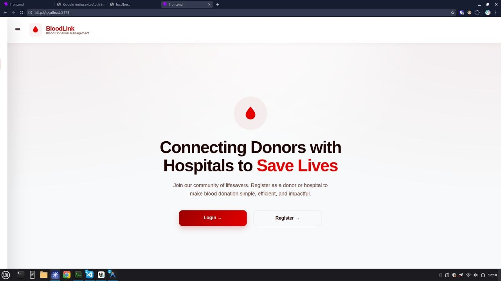
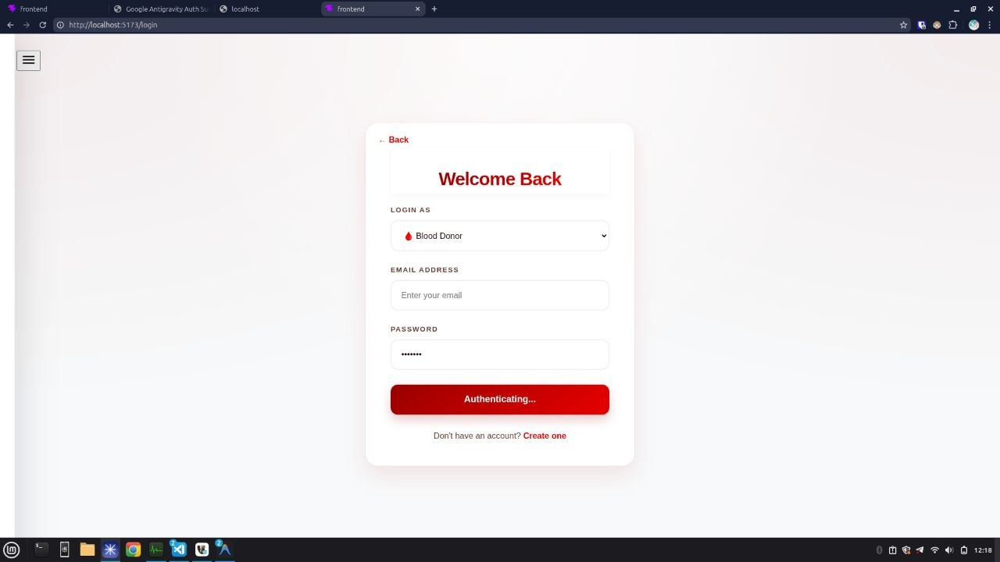
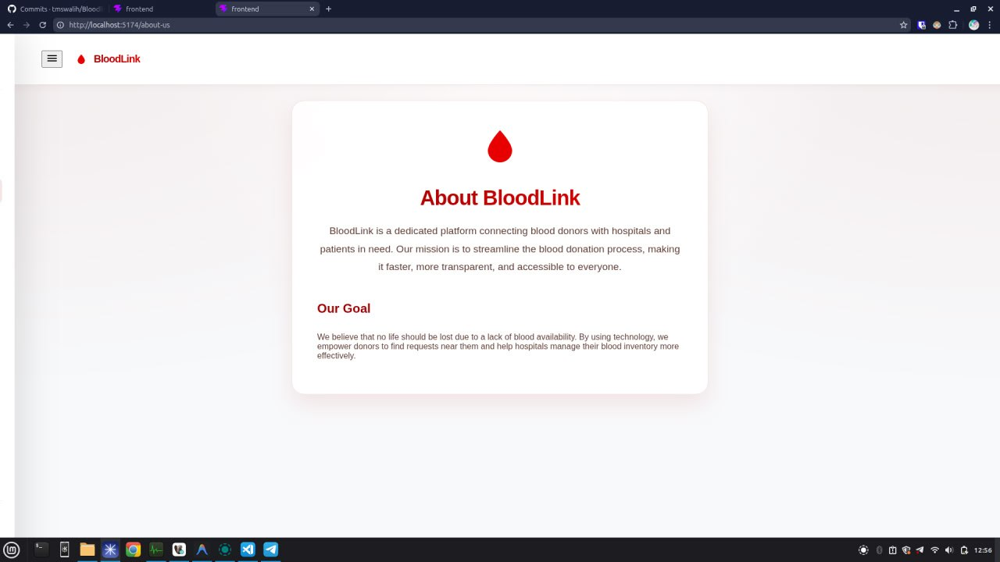
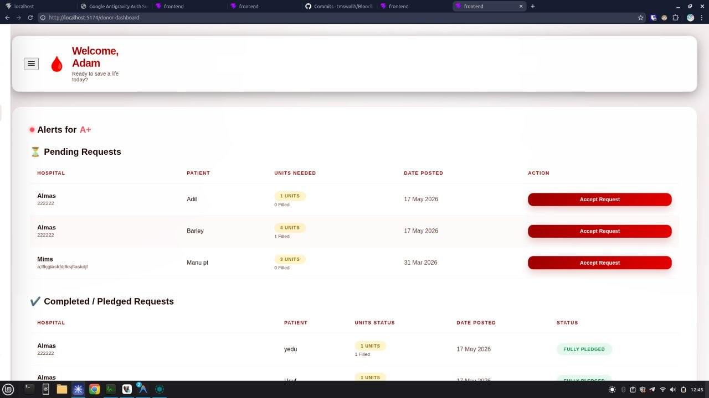
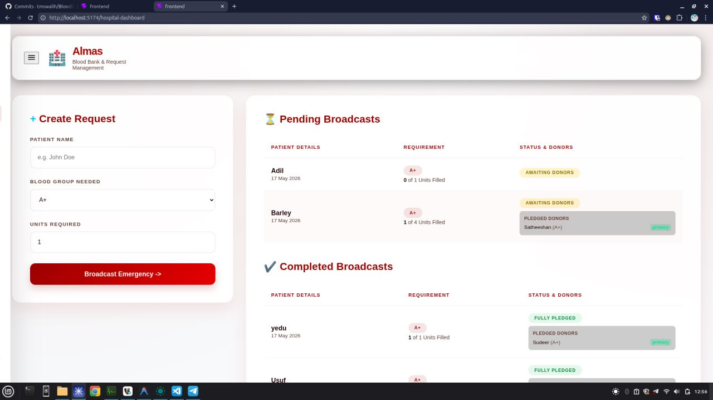

## 🩸 BloodLink – Online Blood Donation Management System
### 📌 Overview
BloodLink is a full-stack web application designed to connect blood donors and hospitals in a fast, efficient, and organized way. It helps hospitals raise blood requests and allows eligible donors to respond in real time, improving emergency response and saving lives.

### 👤 User Roles
Donor

Register & login

View blood requests

Accept donation requests

Track donation history

Hospital

Register & login

Create blood requests

Manage requests

Confirm donors

### 🧠 Core Functionalities
Role-based authentication (Donor / Hospital)

Real-time blood request dashboard

Donor eligibility system:

3 months gap

### 🛠️ Tech Stack
Frontend
React (TypeScript)

Backend
Node.js (Express)

REST API

Database & Services
MySQL

### 🗄️ Database Design
Tables:

donors – donor-specific details

hospitals – hospital details

patients_req (blood_requests) – blood demand info

donations – donor-request mapping

### 🔄 System Workflow
User registers (Donor / Hospital)

User logs in

Hospital creates blood request

Donor views and accepts request

System checks eligibility

Waiting list is created (if needed)

Hospital confirms donation

### 🔌 API Endpoints (Sample)
POST /auth/register

POST /auth/login

GET /requests

POST /requests/create

POST /requests/accept

POST /donation/confirm

### 🎯 Key Highlights
Clean and responsive UI

Real-time updates

### 🔮 Future Enhancements
Location-based donor matching

Mobile application

Notification system

More doner verification technique

AI-based donor recommendations

### 📷 Screenshots
### Home Page

### Login Page

### About Us

### Donor Dashboard

### Hospital Dashboard

### 📌 Installation (Basic)
git clone <your-repo-link>
cd bloodlink
npm install
npm run dev
## 🙌 Conclusion
BloodLink provides a scalable and efficient solution for managing blood donations, reducing delays and improving communication between donors and hospitals.
